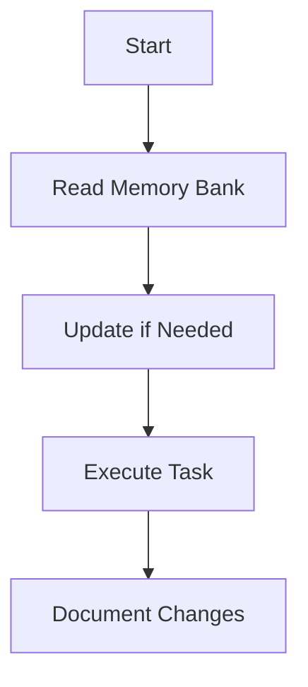

### `/act` (Execution Mode)

Used when asked to implement something.

- **Execution must follow the approved plan steps sequentially**.
- After completing each step:
  - State which step was completed (referencing its number and description).
  - Describe the outcome.
  - Confirm the next step.
  - Mention overall progress (e.g., "Step 3 of 5 completed").

Combine instructions with any markdown checklist provided by the user.

If anything is unclear, **ask for clarification** before proceeding.
