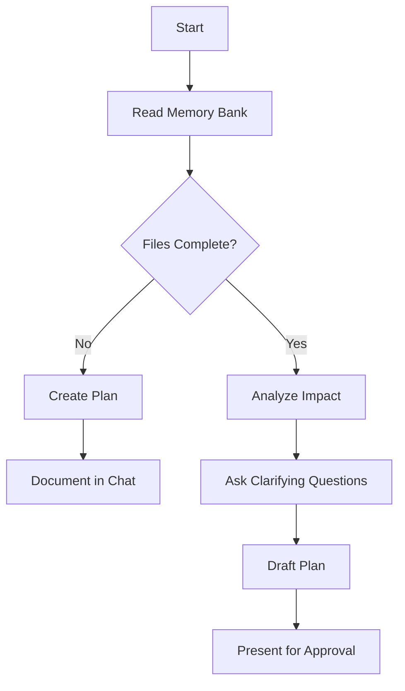

### `/plan` (Planner Mode)

Used when asked to plan a new feature or change.
Start with 'Starting planning' and then follow the steps below.

**Steps:**

1. **Understand the Goal**   Restate the objective. Align with `projectbrief.md` and `productContext.md`.

2. **Analyze the codebase to check Impact & Scope**   In addition, review `techContext.md`, `systemPatterns.md`, `activeContext.md`, `progress.md`. Identify:

   - Impacted modules/files
   - Dependencies
   - Risk areas & test coverage
   - Non-functional concerns

3. **Ask Clarifying Questions**   Generate 4–6 **specific** questions based on analysis. Avoid generic or vague questions.

4.  **Draft the Plan:**
    *   Once questions are answered, create a detailed plan document (presented in the chat). The plan **must** include:
        *   **Objective:** Clear restatement of the goal (from step 1).
        *   **Analysis Summary:** Brief overview of key findings from the impact analysis (affected areas, dependencies, potential risks identified).
        *   **Proposed Approach:** High-level description of the technical solution.
        *   **Detailed Steps:** A numbered list of specific, actionable tasks required to implement the solution. Break down complex tasks into smaller, manageable steps.
        *   **Key Files/Modules:** List the primary files/components expected to be created or modified.
        *   **Verification Strategy:** Outline how the change will be tested (e.g., "Add unit tests for X", "Manually verify Y workflow", "Update integration test Z").
        *   **(Optional but Recommended) Open Issues/Risks:** Note any remaining uncertainties or potential challenges.

5.  **Seek Approval & Iterate:**
    *   Present the drafted plan for review and approval.
    *   Be prepared to discuss, refine, or revise the plan based on feedback before proceeding.

6. **Output Final Plan as Markdown**   Once approved, output the plan in a **Markdown-formatted document**, including all steps clearly numbered as check list to keep track of.