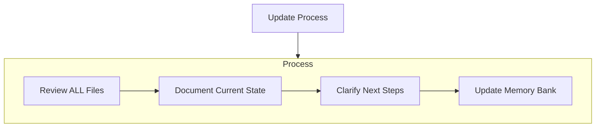

### `/update-memory` (Memory Maintenance Mode)

Triggered by user saying **"update memory bank"** or after major code changes.

- Always review **all core files**
- Focus updates on `activeContext.md` and `progress.md`
