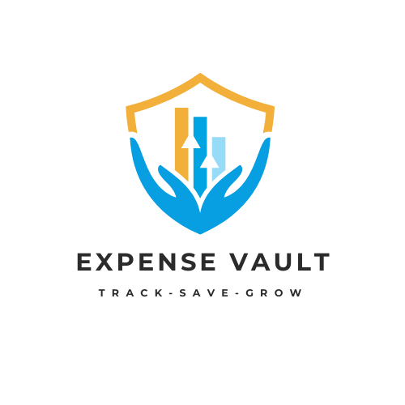
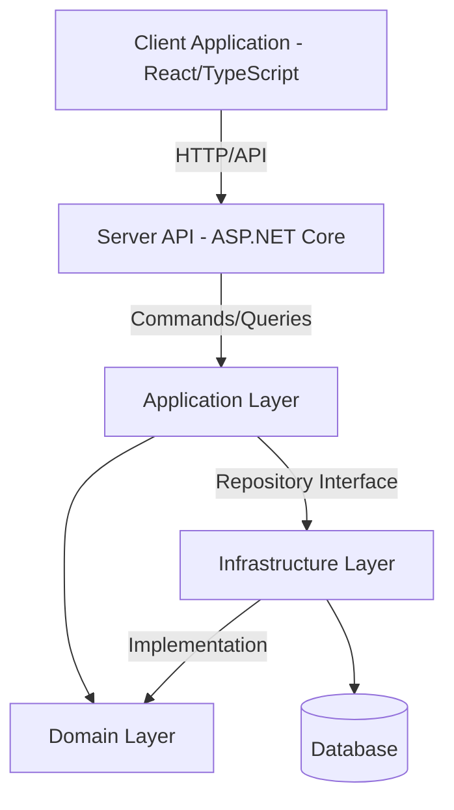

# ExpenseVault - Modern Expense Tracking Solution

<p align="center">
  
  <br>
  <em>Simplify Spending, Amplify Savings</em>
</p>

<p align="center">
  <a href="#overview">Overview</a> •
  <a href="#key-features">Key Features</a> •
  <a href="#demo">Demo</a> •
  <a href="#technical-highlights">Technical Highlights</a> •
  <a href="#architecture">Architecture</a> •
  <a href="#getting-started">Getting Started</a> •
  <a href="#development">Development</a> •
  <a href="#documentation">Documentation</a> •
  <a href="#roadmap">Roadmap</a> •
  <a href="#contributing">Contributing</a> •
  <a href="#license">License</a>
</p>

---

## Overview

**ExpenseVault** is a comprehensive financial management application designed to transform how individuals and businesses track, categorize, and analyze expenses. Built with modern technologies and clean architecture principles, ExpenseVault helps users gain control over their finances through intuitive expense management and powerful insights.

### Problem We Solve

Managing finances effectively requires meticulous expense tracking, which becomes increasingly challenging as transaction volumes grow. Traditional solutions often present steep learning curves, lack comprehensive categorization capabilities, or fail to provide meaningful insights from financial data.

ExpenseVault addresses these challenges by offering a streamlined, intuitive platform that transforms raw financial data into actionable insights, helping users make informed financial decisions.

## Key Features

<p align="center">
  
</p>

### For Individuals

- **Smart Expense Tracking**: Quickly log and categorize personal expenses
- **Budget Management**: Set and monitor spending limits across categories
- **Financial Insights**: Visualize spending patterns with interactive charts
- **Secure Storage**: Safely store and organize expense receipts
- **Customizable Categories**: Tailor the system to your unique financial needs

### For Businesses

- **Team Collaboration**: Manage expenses across departments with role-based access
- **Approval Workflows**: Streamline expense submission and approval processes
- **Business Reporting**: Generate comprehensive financial reports for analysis
- **Data Export**: Compatible with popular accounting software
- **Audit Trail**: Maintain complete history of financial activities

## Demo

Experience ExpenseVault in action:

- **[Live Demo](https://youtube.com)** - Try the application with sample data
- **[Video Walkthrough](https://www.youtube.com/watch?v=expensevault)** - See key features in action

## Technical Highlights

ExpenseVault showcases modern software development practices and technologies:

### Backend Excellence

- **Clean Architecture**: Clear separation of concerns with domain-centric design
- **Domain-Driven Design**: Business-focused development approach
- **CQRS Pattern**: Command and Query Responsibility Segregation for optimal performance
- **Robust Security**: JWT authentication with refresh token rotation and secure data handling
- **Comprehensive Testing**: Unit, integration, and end-to-end test coverage

### Frontend Innovation

- **React 19 Features**: Leveraging the latest React capabilities
- **TypeScript**: Type-safe development throughout the application
- **Responsive Design**: Seamless experience across devices
- **State Management**: Efficient data flow and component architecture
- **Accessibility**: WCAG compliance for inclusive user experience

## Architecture

ExpenseVault implements a clean, modular architecture following domain-driven design principles:



### Layer Overview

#### 1. Domain Layer (EV.Domain)

The core of the application containing business entities and logic:

- **Entities**: Expense, Category, Account, Budget models
- **Value Objects**: Money, DateRange, RecurrenceRule
- **Domain Events**: ExpenseCreated, CategoryUpdated
- **Domain Services**: Core business logic without external dependencies

#### 2. Application Layer (EV.Application)

Orchestrates the application workflow:

- **Commands/Queries**: Following CQRS pattern for clear separation
- **DTOs**: Data transfer objects for API communication
- **Validators**: Input validation logic using FluentValidation
- **Mappers**: Object transformation between layers
- **Authorization**: Fine-grained permission system

#### 3. Infrastructure Layer (EV.Infrastructure)

Provides technical capabilities:

- **Data Persistence**: Entity Framework Core implementation
- **Identity Services**: Authentication and user management
- **External Integrations**: Email, storage, payment processing
- **Caching**: Performance optimization strategies

#### 4. Presentation Layer

- **ExpenseVault.Server**: ASP.NET Core API backend
- **expensevault.client**: Modern responsive frontend with React 19

## Technology Stack

### Backend

- **.NET 8**: Latest .NET platform
- **ASP.NET Core**: Web API framework
- **Entity Framework Core**: ORM with code-first approach
- **MediatR**: CQRS implementation
- **FluentValidation**: Request validation
- **JWT Authentication**: Secure token-based auth

### Frontend

- **React 19**: Modern UI library
- **TypeScript**: Type-safe JavaScript
- **Tailwind CSS & DaisyUI**: Styling and components
- **Vite**: Build tool
- **React Router**: Navigation
- **Vitest**: Testing framework

### Database & Storage

- **SQL Server/PostgreSQL**: Relational database
- **Redis**: Caching (optional)
- **Azure Blob Storage**: File storage

### DevOps

- **Docker**: Containerization
- **Azure DevOps**: CI/CD pipeline
- **GitHub Actions**: Automation

## Getting Started

### Prerequisites

- .NET 8 SDK
- Node.js (v18+)
- pnpm
- SQL Server or PostgreSQL

### Installation

1. **Clone the repository**

   ```bash
   git clone https://github.com/yourusername/ExpenseVault.git
   cd ExpenseVault
   ```

2. **Set up the database**

   ```bash
   dotnet ef --project .\EV.Infrastructure --startup-project .\ExpenseVault.Server database update
   ```

3. **Start the backend**

   ```bash
   cd ExpenseVault.Server
   dotnet run
   ```

4. **Start the frontend**

   ```bash
   cd expensevault.client
   pnpm install
   pnpm dev
   ```

5. **Access the application**

   Open your browser and navigate to `https://localhost:5173`

## Development

### Project Structure

```
ExpenseVault/
├── EV.Domain/            # Domain layer with business entities
├── EV.Application/       # Application layer with CQRS
├── EV.Infrastructure/    # Infrastructure implementations
├── ExpenseVault.Server/  # ASP.NET Core API backend
├── expensevault.client/  # React frontend
└── docs/                 # Documentation
```

### Development Workflow

1. Create feature branch from `main`
2. Implement changes with tests
3. Submit pull request for review
4. Merge to `main` after approval
5. CI/CD pipeline deploys to staging

### Testing

- **Backend**: Run `dotnet test` in the solution directory
- **Frontend**: Run `pnpm test` in the client directory

## Roadmap

ExpenseVault is continuously evolving. Our upcoming features include:

- **Q3 2025**: Mobile applications for iOS and Android
- **Q4 2025**: Advanced reporting and analytics
- **Q1 2026**: Budget planning and forecasting
- **Q2 2026**: OCR receipt scanning
- **Q3 2026**: Accounting software integrations

## Documentation

For more detailed information about ExpenseVault, please refer to these additional resources:

- [Product Overview](./docs/product-overview.md) - Detailed description of ExpenseVault's value proposition and benefits
- [Technical Case Study](./docs/technical-case-study.md) - In-depth exploration of the technical implementation and architecture
- [API Documentation](./docs/api-docs.md) - Complete API reference *(coming soon)*
- [User Guide](./docs/user-guide.md) - Comprehensive instructions for end users *(coming soon)*

## Contributing

We welcome contributions! Please see our [Contributing Guide](CONTRIBUTING.md) for details on how to get started.

## License

This project is licensed under the MIT License - see the [LICENSE](LICENSE) file for details.

---

<p align="center">
  <sub>Built with ❤️ by <a href="http://github.com/hoangmyit">My Hoang</a></sub>
</p>

<p align="center">
  <a href="https://www.facebook.com/hoangmyld"></a>
  &nbsp;&nbsp;
  <a href="https://www.linkedin.com/in/hoang-my"></a>
</p>
