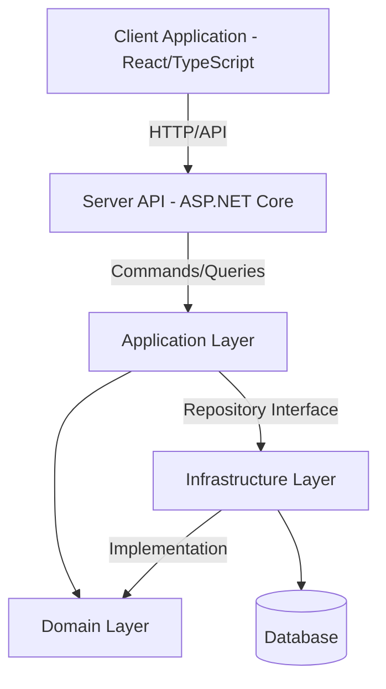
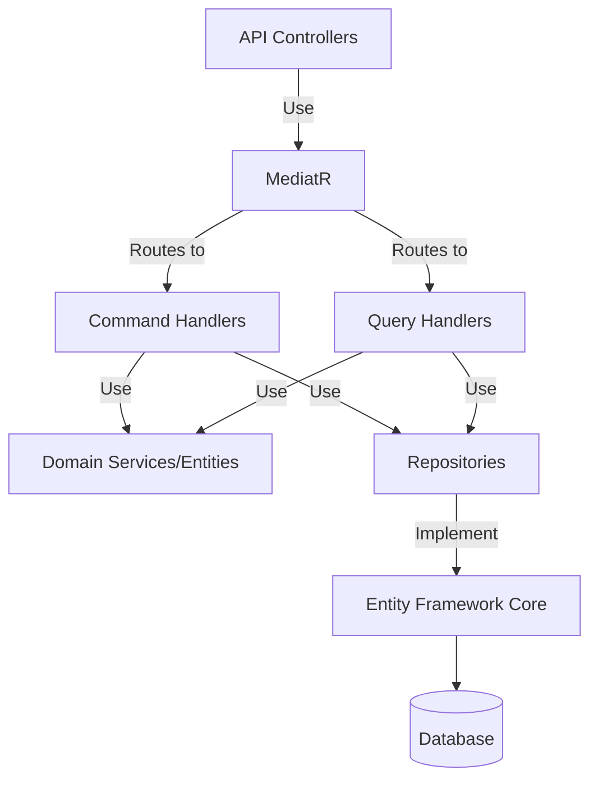
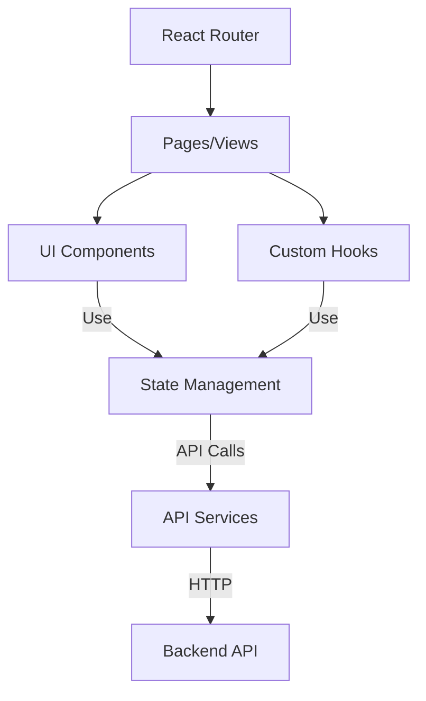
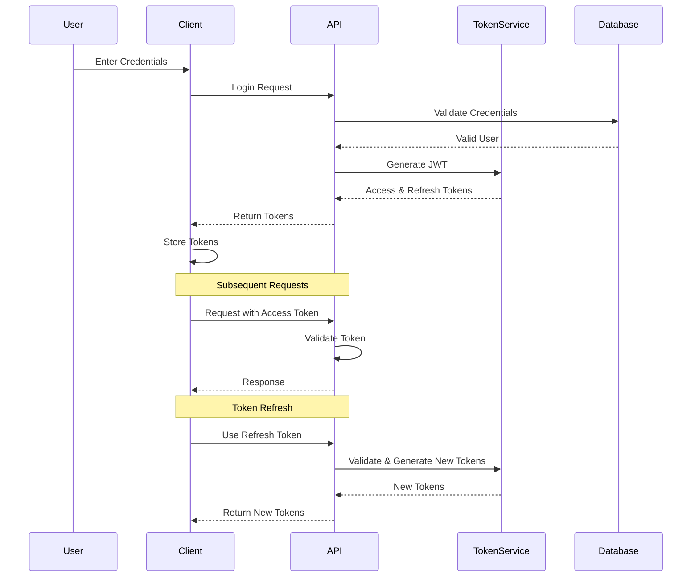
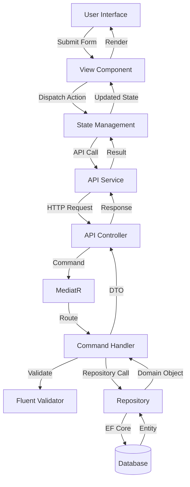

# System Patterns: ExpenseVault

## Architectural Overview

ExpenseVault implements a clean, modular architecture following domain-driven design principles, structured in layers with clear separation of concerns:

## Key Architecture Patterns

### Clean Architecture

The solution follows Clean Architecture principles with concentric layers:

1. **Core (Domain)**: Contains business entities and logic, free from external dependencies
2. **Application**: Contains business use cases, coordinating domain entities
3. **Infrastructure**: Implements interfaces defined in the application layer
4. **Presentation**: Handles user interaction and API endpoints

Dependencies flow inward, with inner layers having no knowledge of outer layers, ensuring:

- Separation of concerns
- Testability
- Flexibility to change external systems

### Domain-Driven Design (DDD)

The domain model is designed around the core business concepts:

- **Entities**: Long-lived objects with identity (Expense, Category, Account)
- **Value Objects**: Immutable objects defined by attributes (Money, DateRange)
- **Aggregates**: Clusters of entities and value objects with a root entity
- **Domain Events**: Record significant state changes (ExpenseCreated, CategoryUpdated)
- **Repositories**: Abstract data access for domain objects

### Command Query Responsibility Segregation (CQRS)

The application layer is organized using CQRS pattern:

- **Commands**: Handle state changes (CreateExpense, UpdateCategory)
- **Queries**: Retrieve data without modifying state (GetExpensesList, GetCategoryDetails)
- **Handlers**: Process commands or queries and return results
- **Mediator**: Routes commands and queries to appropriate handlers

### Repository Pattern

Data access is abstracted through repositories:

- Domain entities are persisted through repository interfaces
- Implementation details (EF Core) are isolated in the infrastructure layer
- Repositories maintain the integrity of domain aggregates

## Component Relationships

### Backend Components

### Frontend Components

## Authentication Flow

## Data Flow

## Error Handling Pattern

The application implements a centralized error handling approach:

- Domain exceptions capture business rule violations
- Application exceptions represent use case failures
- Infrastructure exceptions handle technical issues
- Global exception middleware transforms exceptions into appropriate HTTP responses
- Frontend error boundaries catch and display user-friendly messages

## Validation Strategy

- **Domain Validation**: Enforces invariants within domain entities
- **Application Validation**: Uses FluentValidation for command/query validation
- **API Validation**: Leverages model binding validation
- **Client Validation**: Implements form validation before submission

**Current Date:** May 25, 2025
