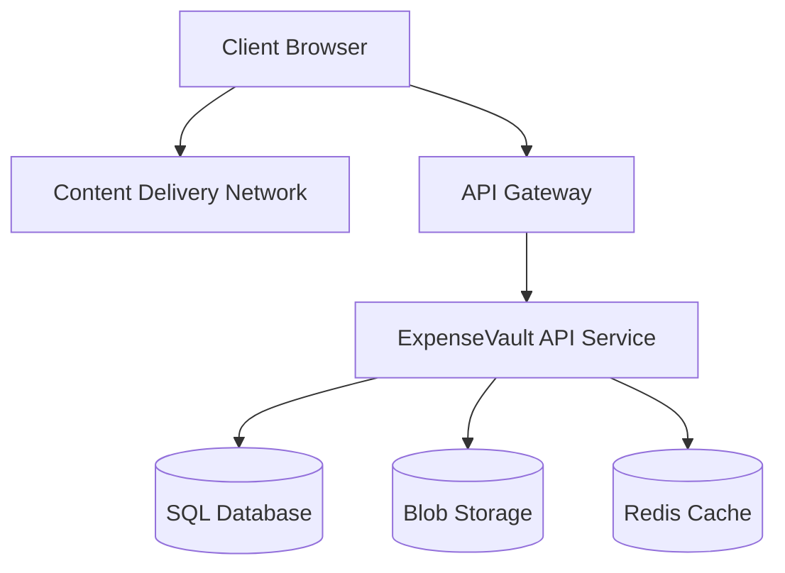

# Technical Context: ExpenseVault

## Technology Stack

### Backend

- **Framework**: .NET 8 with ASP.NET Core
- **Architecture**: Clean Architecture / Onion Architecture
- **API**: RESTful API with Swagger/OpenAPI documentation
- **Data Access**: Entity Framework Core (Code-First approach)
- **Authentication**: JWT token-based auth with refresh capabilities
- **Patterns**: CQRS with MediatR, Repository Pattern, DDD principles
- **Validation**: FluentValidation for input validation
- **Testing**: xUnit, NSubstitute, and Fluent Assertions

### Frontend

- **Framework**: React 19 with TypeScript
- **Build Tool**: Vite
- **Styling**: Tailwind CSS with DaisyUI components
- **State Management**: Custom hooks and context
- **Routing**: React Router
- **API Communication**: Axios with interceptors
- **Testing**: Vitest with React Testing Library

### Database

- **Primary Database**: SQL Server / PostgreSQL
- **ORM**: Entity Framework Core with migrations
- **Data Schema**: Code-First approach with domain models

### DevOps & Infrastructure

- **Source Control**: Git
- **CI/CD**: Azure DevOps
- **Containerization**: Docker with docker-compose
- **Deployment**: Azure App Service

## Development Environment

### Required Tools

- **IDE**: Visual Studio 2022+ or VS Code
- **SDK**: .NET 8 SDK
- **Node.js**: v18+ for frontend development
- **Package Manager**: pnpm (preferred for frontend)
- **Database**: SQL Server (or PostgreSQL) instance
- **Git**: For version control

### Local Setup

1. Clone repository
2. Install .NET 8 SDK
3. Install Node.js and pnpm
4. Run database migrations:

   ```bash
   dotnet ef --project .\EV.Infrastructure --startup-project .\ExpenseVault.Server database update
   ```

5. Start backend (ExpenseVault.Server)
6. Start frontend with `pnpm dev`

### Development Workflow

1. Feature branches created from main
2. Code reviews via pull requests
3. CI runs tests and builds
4. Deployment after successful reviews and tests

## Technical Constraints

### Performance Requirements

- API response time under 300ms for standard operations
- Support for at least 10,000 expense entries per user
- Efficient handling of reporting queries on large datasets
- Optimized asset delivery for frontend application

### Security Requirements

- HTTPS for all communications
- JWT token authentication with refresh token rotation
- Password storage using secure hashing (Argon2id)
- Input validation on both client and server
- Content Security Policy implementation
- Protection against common web vulnerabilities (CSRF, XSS, injection)
- Regular security audits

### Compatibility Requirements

- Modern browsers (last 2 versions)
- Mobile-responsive design for all screen sizes
- Progressive enhancement for core functionality

## Integration Points

### External Services

- Email service for notifications
- Storage service for receipts and attachments
- (Potential) Payment processor integration
- (Potential) Third-party accounting software integration

### Internal APIs

- Authentication API
- Expense management API
- Reporting API
- User management API

## Monitoring & Observability

- Application logging with structured logs
- Performance metrics collection
- Error tracking and alerting
- Usage analytics

## Deployment Architecture



## Technical Debt & Limitations

- Initial version has limited reporting capabilities
- Mobile applications planned for future releases
- OCR receipt scanning to be added in future iterations
- Limited offline capabilities in the initial release

**Current Date:** May 25, 2025
